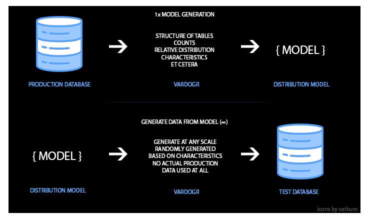

# Vardøgr

Realistic test data in development and qa environments can pinpoint bugs and performance issues early. However taking direct copies violates the security of data and takes time. It also does not scale. 

Vardøgr is a tool that can push production-like data to test databases securely. It does this by generating a distribution model of the data first - describing the data and its relative distribution. 

It can then run this model and generate data from it, either directly matching the origin size or scaling up. 

## Limitations
Currently using JOOQ's open source version, which only allows for connecting with open source databases. 
Only tested with MariaDB, MySQL and PostgreSQL.

## Commands
> build 

Start with this command. This will build up the distribution model from the production database. It will ask you for read-only credentials.
Upon rerun, it will remember a valid configuration file and skip asking for credentials. Password is stored encrypted.

>generate --factor 2 --clean

This takes a distribution model and applies it to a lower environment database. It will ask for credentials which require write access.
There are two parameters:
- factor: Allows for scaling the model by a certain factor. Ie: generate --factor 2 will generate data 2x the size of the production data.
- clean: By default, the generation 'appends'. Ie if a production table contains 100 records and the same table contains 25 records in test, by default it will only add 75 new records. By explicitly defining the clean option, it will trunctate the data first and create 100 brand new records.

> help

You can always use help to get up to date documentation on available commands.

## How to build / run 
This product uses Spring Shell and Maven. As such, you can build the project as such: 
> mvn clean install

and run it as such: 
> mvn spring-boot:run
